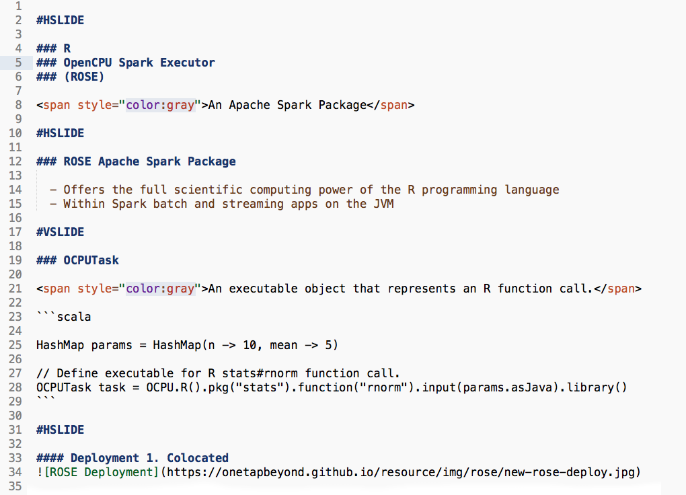
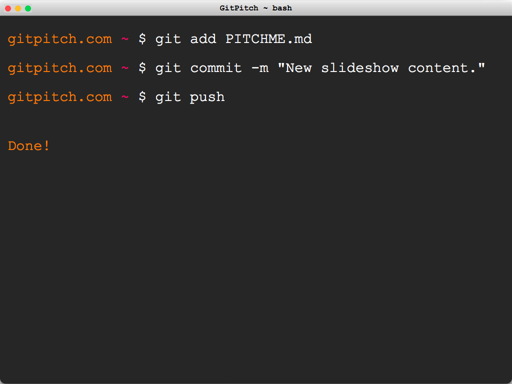

#HSLIDE

####Get the word out!
 
Promote, Pitch, Or Present Your GitHub Projects

#HSLIDE

###GitPitch turns PITCHME.md into interactive, online slideshows.

#HSLIDE
<!-- .slide: data-autoslide="2000" -->

###No more Keynote.
###No more Powerpoint.
 
###Just Markdown. Then Git-Commit.</li>

#HSLIDE

STEP 1. PITCHME.md

Create GitPitch slideshow content using GitHub flavored Markdown in your favorite editor.

#HSLIDE

STEP 2. Git-Commit

Git-commit on any repo branch and push your PITCHME.md to GitHub.

#HSLIDE

STEP 3. Get The Word Out!

 

https://gitpitch.com/user/repo

 

Instantly use your GitPitch slideshow URL to promote, pitch or present your GitHub project.

#HSLIDE

THERE IS LOTS TO LOVE...

- GitHub Flavored Markdown
- Code Block Syntax Highlighting
- Embed GISTs
- Embed Images and Videos too
- Add Custom Logos, Switch Themes
- Custom Backgrounds And Much, Much More
- And Of Course
- Everything under Git Version Control :)

#HSLIDE

###Go for it.
###Just add PITCHME.md ;)

