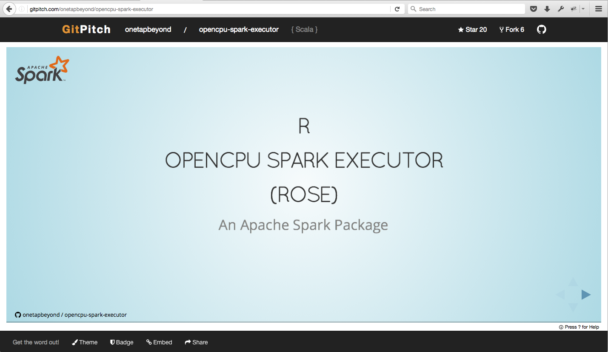

#HSLIDE

####Get the word out!
 
Promote, Pitch, Or Present Your GitHub Projects

#HSLIDE

###GitPitch turns PITCHME.md into interactive, online slideshows.

#HSLIDE

###No more Keynote.
###No more Powerpoint.</li>
 
###Just Markdown. Then Git-Commit.</li>

#HSLIDE

Step 1. PITCHME.md

Create GitPitch slideshow content using GitHub flavored Markdown in your favorite editor.

#HSLIDE

Step 2. Git-Commit

Git-commit on any repo branch and push your PITCHME.md to GitHub.

#HSLIDE

Step 3. Get the word out!

 

https://gitpitch.com/user/repo

 

Instantly use your GitPitch slideshow URL to promote, pitch or present your GitHub project.

#HSLIDE

Sample GitPitch interactive, online slideshow.

