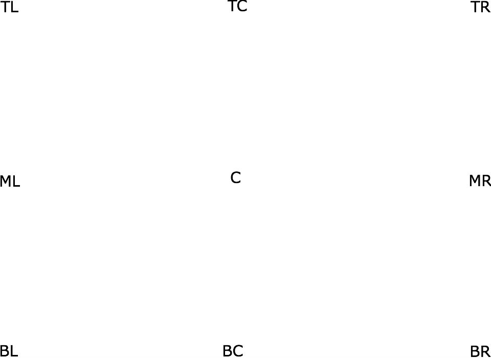
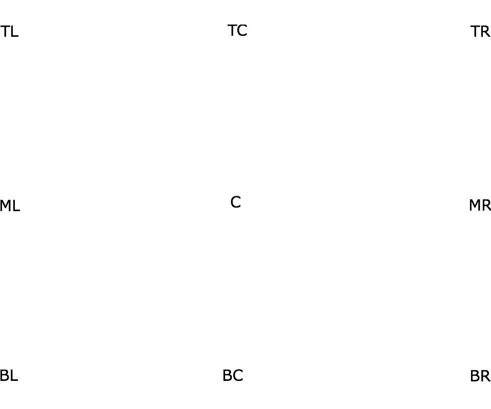

#HSLIDE

#HSLIDE?image=assets/coords-960-700.jpg

#HSLIDE

#HSLIDE?image=assets/coords-960-800.jpg

####Get the word out!
 
Promote, Pitch, Or Present Your GitHub Projects

#HSLIDE

###No more Keynote.
###No more Powerpoint.</li>
 
###Just Markdown. Then Git-Commit.</li>

#HSLIDE?image=assets/markdown.jpg

#HSLIDE

#HSLIDE?image=assets/terminal.png

#HSLIDE

#VSLIDE

#VSLIDE

#HSLIDE

###Instead we power up PowerPoint or Keynote...

###Until now!</li>

#HSLIDE

###Say something compelling about GP.

