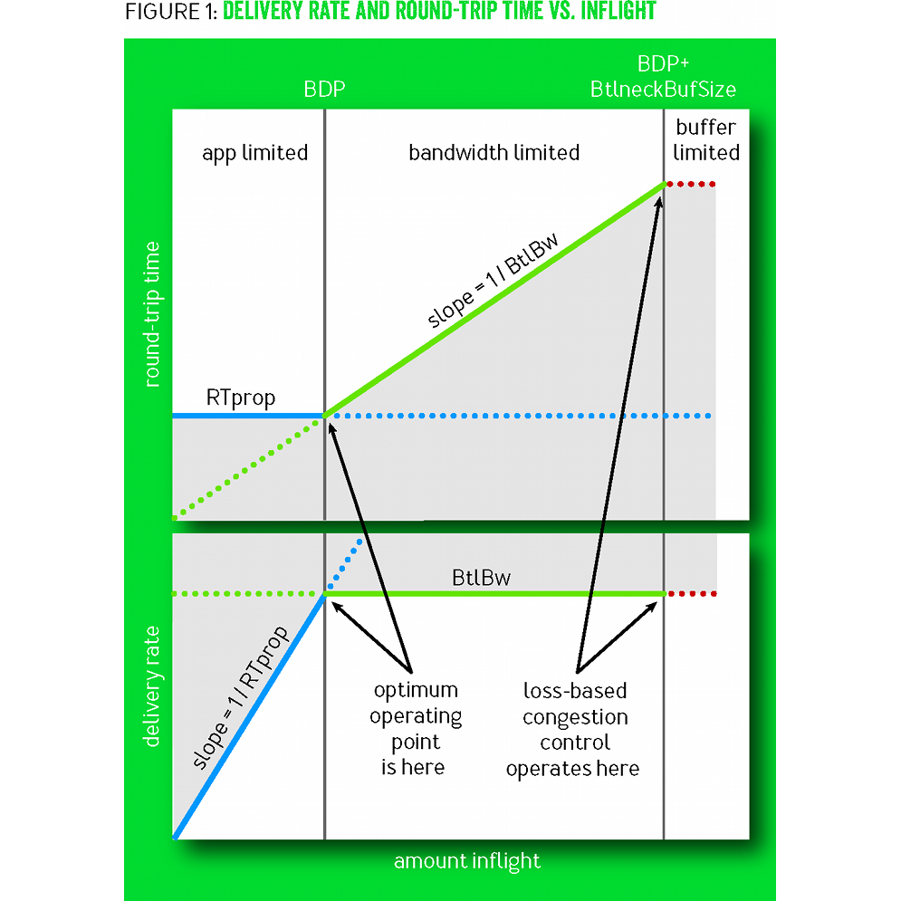
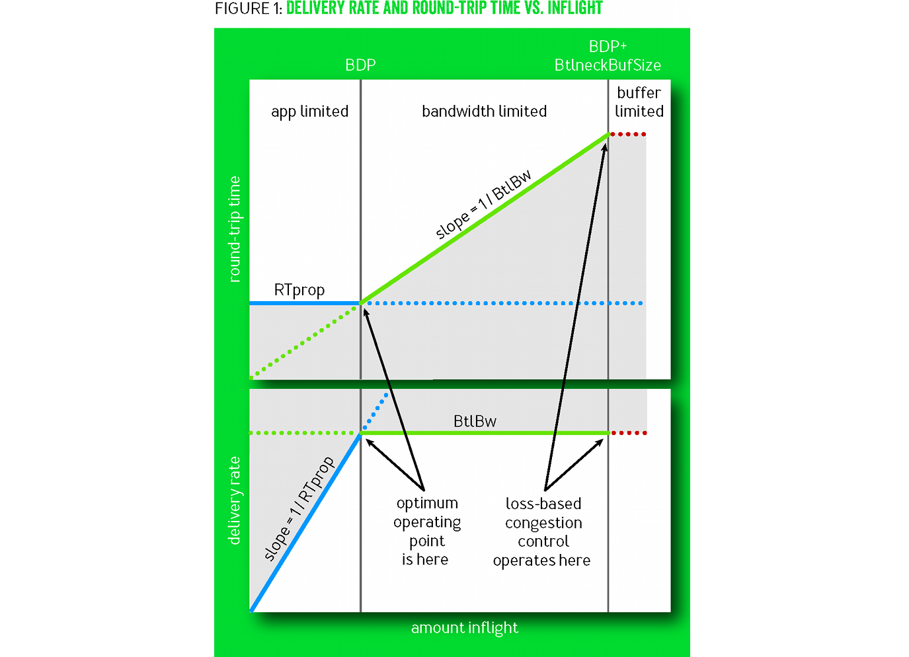

## ReBBR: Reproducing BBR Performance on Lossy Networks

Luke Hsiao and Jervis Muindi

June 2017

---

### Introduction: BBR Congestion-based Congestion Control

TODO

---

---?image=http://deliveryimages.acm.org/10.1145/3030000/3022184/vanjacobson1.png

---

<!-- .slide: data-background-image="http://deliveryimages.acm.org/10.1145/3030000/3022184/vanjacobson1.png" data-background-size="100% 100%" -->

# 100%

---

<!-- .slide: data-background-image="http://deliveryimages.acm.org/10.1145/3030000/3022184/vanjacobson1.png" data-background-size="95% 95%" -->

# 95%

---

<!-- .slide: data-background-image="http://deliveryimages.acm.org/10.1145/3030000/3022184/vanjacobson1.png" data-background-size="90% 90%" -->

# 90%

---

<!-- .slide: data-background-image="http://deliveryimages.acm.org/10.1145/3030000/3022184/vanjacobson1.png" data-background-size="80% 80%" -->

# 80%

---

<!-- .slide: data-background-image="http://deliveryimages.acm.org/10.1145/3030000/3022184/vanjacobson1.png" data-background-size="120% 120%" -->

--

<!-- .slide: data-background-image="http://deliveryimages.acm.org/10.1145/3030000/3022184/vanjacobson1.png" data-background-size="cover" -->

---

<!-- .slide: data-background-image="http://deliveryimages.acm.org/10.1145/3030000/3022184/vanjacobson1.png" data-background-size="auto" -->

---

<!-- .slide: data-background-image="http://deliveryimages.acm.org/10.1145/3030000/3022184/vanjacobson1.png" data-background-size="contain" -->

---

</img>

---

The next slide is a standard Markdown image of squared

---

---

<!-- .slide: data-background-image="https://raw.githubusercontent.com/themarchoffolly/pushme-pullyou/rebbr/assets/vanjacobson1-squared.png" data-background-size="contain" -->

---

The next slide is a standard Markdown image of reversed-ar

---

---

<!-- .slide: data-background-image="https://raw.githubusercontent.com/themarchoffolly/pushme-pullyou/rebbr/assets/van-reverse-aspect-ratio.png" data-background-size="contain" -->

---

<!-- .slide: data-background-image="https://raw.githubusercontent.com/themarchoffolly/pushme-pullyou/rebbr/assets/van-reverse-aspect-ratio.png" data-background-size="auto" -->

---

<!-- .slide: data-background-image="https://raw.githubusercontent.com/themarchoffolly/pushme-pullyou/rebbr/assets/van-reverse-aspect-ratio.png" data-background-size="100% 100%" -->

